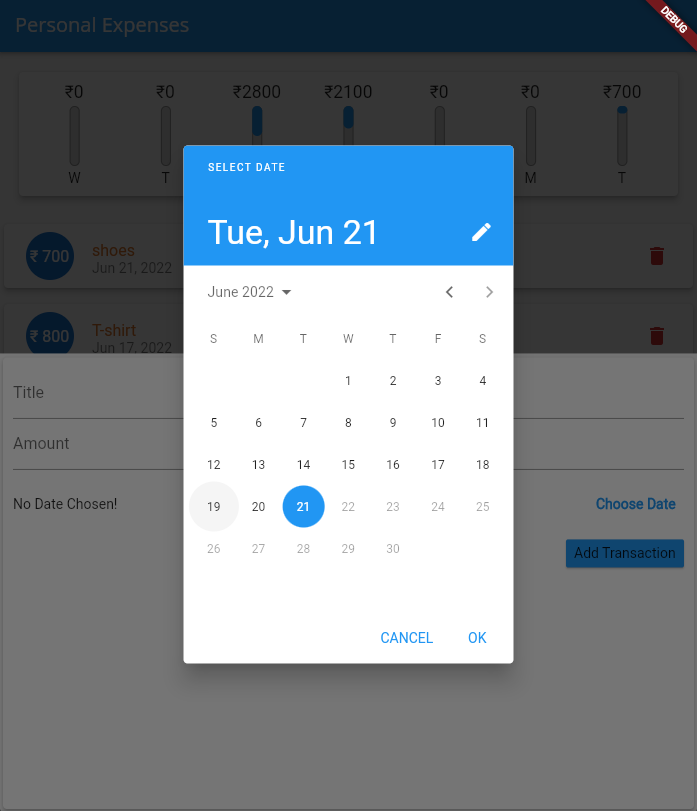

# EXPENSES APP

A Flutter App with which you can track your daily expenditures. It shows a Real-Time Weekly Bar chart of the tracked Expenditures. You can also delete an add expenditure.
You can also pick dates using the datepicker.

## Details
### Track your expenses. See Weekly Bar Chart. Made with Flutter.
• Simple – Easy to add and delete all your expenses.

• Private – No Tracking. All your expenses data remains on your phone. If you uninstall the app the data is automatically deleted

• Open Source – Expense Tracker is a completely open source app made by a single developer from scratch.

## Screenshots

